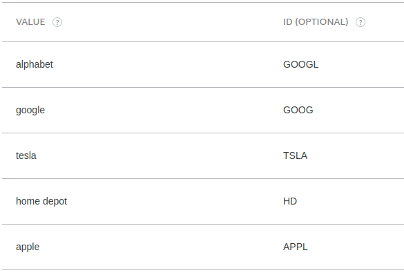

# Go_Trade_Me
Alexa Skill made in Go that outputs current NYSE Stock Prices for a given stock ticker

### This is my first Go program - Please don't judge it too harshly xD


### Building

<b>GOOS=linux go build -o main *.go</b>

<b>zip deployment.zip main</b>

<b>Upload as ZIP in AWS Lambda</b>

or...

<b>./deploy.sh</b>

### Getting Stock Tickers from Company Name


Each company name is saved as a slot value, and each slot value has an ID that corresponds to the stock ticker for that company.

```go
stockName := i.Request.Intent.Slots.StockVals.Value
// ie: Google, Tesla, Home Depot, etc.
stockTicker := i.Request.Intent.Slots.StockVals.Resolutions.ResolutionsPerAuthority[0].Values[0].Value.ID
// ie: GOOG, TSLA, HD, etc.
```

### Request Structure

```go
type GoTradeMeRequestStruct struct {
	// This is the structure for the JSON input
	Version string `json:"version"`
	Request struct {
		Type   string `json:"type"`
		Time   string `json:"timestamp"`
		Intent struct {
			Name               string `json:"name"`
			ConfirmationStatus string `json:"confirmationStatus"`
			Slots              struct {
				StockVals struct {
					Name        string `json:"name"`
					Value       string `json:"value"`
					Resolutions struct {
						ResolutionsPerAuthority []struct {
							Authority string `json:"authority"`
							Status    struct {
								Code string `json:"code"`
							} `json:"status"`
							Values []struct {
								Value struct {
									Name string `json:"name"`
									ID   string `json:"id"`
								} `json:"value"`
							} `json:"values"`
						} `json:"resolutionsPerAuthority"`
					} `json:"resolutions"`
					ConfirmationStatus string `json:"confirmationStatus"`
				} `json:"stockVals"`
			} `json:"slots"`
		} `json:"intent"`
	} `json:"request"`
}
```

### Response Structure

```go
type AlexaResponse struct {
	// This is the structure for the response object
	Version  string `json:"version"`
	Response struct {
		OutputSpeech struct {
			Type string `json:"type"`
			Text string `json:"text"`
		} `json:"outputSpeech"`
		EndSession  bool `json:"shouldEndSession"`
	} `json:"response"`
}
```

### Slot Value Format

```javascript
{
    "id": "WYN",
"name": {
    "value": "Wyndham Worldwide"
    }
},
{
    "id": "WYNN",
"name": {
    "value": "Wynn Resorts Ltd"
    }
},
{
    "id": "XEL",
"name": {
    "value": "Xcel Energy"
    }
},
{
    "id": "XRX",
"name": {
    "value": "Xerox Corp"
    }
}
```

<b>or</b>

<p align="center">

</p>
<p align="center">View from the Alexa Skill Kit</p>
